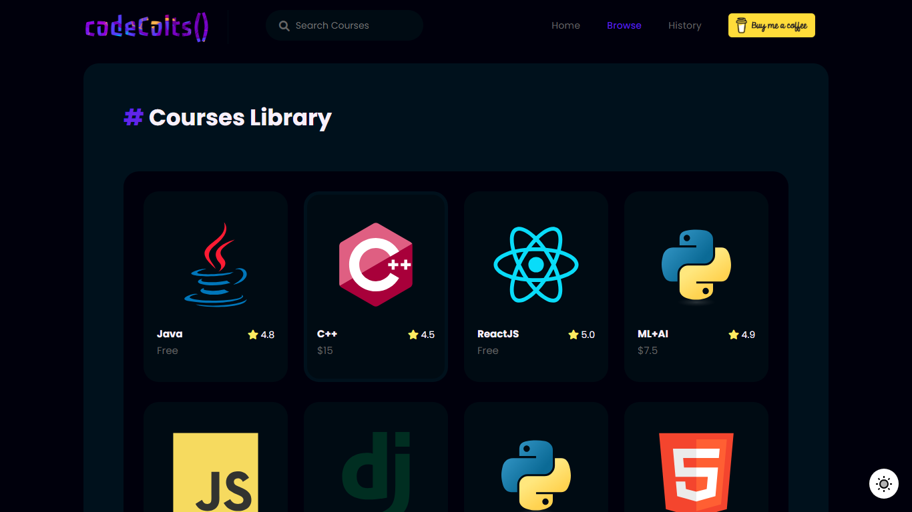

  
  
  

    One Stop for all your coding needs! 
    That too for FREEE!
  

  

  
<!-- Badges -->

  
  
  
  

   
<h4>
    <a href="https://github.com/codeintrovert/codeColts/">View Demo</a>
   · 
    <a href="https://github.com/codeintrovert/codeColts">Documentation</a>
   · 
    <a href="https://github.com/codeintrovert/codeColtse/issues/">Report Bug</a>
   · 
    <a href="https://github.com/codeintrovert/codeColts/issues/">Request Feature</a>
  </h4>

 

<!-- Table of Contents -->
# :notebook_with_decorative_cover: Table of Contents

- [About the Project](#star2-about-the-project)
  * [Tech Stack](#space_invader-tech-stack)
  * [Features](#dart-features)
  * [Color Reference](#art-color-reference)

- [Roadmap](#compass-roadmap)
- [Contributing](#wave-contributing)
- [License](#warning-license)
- [Contact](#handshake-contact)
- [Acknowledgements](#gem-acknowledgements)
  

<!-- About the Project -->
## :star2: About the Project

 
  
  

<!-- TechStack -->
### :space_invader: Tech Stack

  
Frontend

  <ul>
    <li><a href="https://www.python.org">Python</a></li>
    <li><a href="https://www.jinja.org/">Jinja</a></li>
    <li><a href="https://Sass.org/">Sass</a></li>
    <li><a href="https://Bootstarp.com/">Bootstrap</a></li>
  </ul>

  
Backend

  <ul>
    <li><a href="https://">Python</a></li>
    <li><a href="https://">Flask</a></li>
    <li><a href="https://">JavaScript</a></li>
  </ul>

<!-- Features -->
### :dart: Features

- Large Free Courses Library
- No Ads
- No Sign Up Required

<!-- Color Reference -->
### :art: Color Reference

| Color             | Hex                                                                |
| ----------------- | ------------------------------------------------------------------ |
| Accent Color |  #6320ee |
| Text Color |  #f8f0fb |
| Background Color |  #00000d |
| Foreground Color |  #01111d |

<!-- Usage -->
## :eyes: Visit Live Project!
<ul><li>
<a href="https://CodeColts.vercel.app/">CodeColts()</a>
</li></ul>

<!-- Roadmap -->
## :compass: Roadmap

* [x] Complete Frontend
* [x] Build Courses Library
* [x] Light/Dark Mode
* [x] Viewport and video embed
* [ ] Complete Courses Library
* [ ] Build Certify (Certification engine) (Generate Employable report and score)
* [ ] Add project ideas for Btech Final Year (openCV, MERN CRUD, etc)
* [ ] Add 90DaysOfDSA integration
* [ ] Shift Data base to Mongodb

<!-- Contributing -->
## :wave: Contributing

Contributions are always welcome!

<!-- License -->
## :warning: License

The materials herein are all &copy; 2023 Hasan Imam.

 This work is licensed under a <a rel="license" href="http://creativecommons.org/licenses/by-nc-nd/4.0/">Creative Commons Attribution-NonCommercial-NoDerivs 4.0 Unported License</a>.

<!-- Contact -->
## :handshake: Contact

Hasan Imam

Email: codeColts@gmail.com
Instagram: [@introvertCoder](https://instagram.com/introvertcoder)
Youtube: [@introvertcoder](https://www.youtube.com/introvertCoder)

<!-- Acknowledgments -->
## :gem: Acknowledgements

 - [Shields.io](https://shields.io/)
 - [Awesome README](https://github.com/matiassingers/awesome-readme)
 - [Emoji Cheat Sheet](https://github.com/ikatyang/emoji-cheat-sheet/blob/master/README.md#travel--places)
 - [Readme Template](https://github.com/othneildrew/Best-README-Template)
